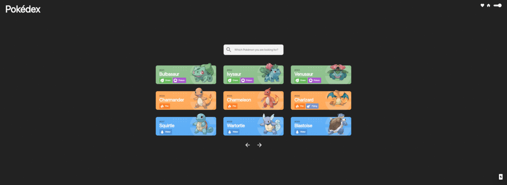

<h1 align="center">
  
</h1>

My Pokedex Project

  <a href="https://pokedex.robertveloso.vercel.app">Demo</a>&nbsp;&nbsp;&nbsp;|&nbsp;&nbsp;&nbsp;
  <a href="https://www.figma.com/file/GFdu7vRg8anWD3kQ1za9n4/Pokedex?node-id=0%3A1">Figma</a>&nbsp;&nbsp;&nbsp;|&nbsp;&nbsp;&nbsp;
  <a href="#rocket-techs">Techs</a>&nbsp;&nbsp;&nbsp;|&nbsp;&nbsp;&nbsp;
  <a href="#computer-build-in-your-machine">Build in your machine</a>&nbsp;&nbsp;&nbsp;|&nbsp;&nbsp;&nbsp;
  <a href="#memo-license">License</a>

  

  

## :rocket: Techs

This project was built using:

- [React](https://reactjs.org/)
- [Next.js](https://nextjs.org)
- [Redux](https://redux.js.org)
- [Styled-Components](https://styled-components.com)
- ...others

## :computer: Build in your machine

Clone this repo.

### Root

- Run `yarn` to install dependencies;
- Run `yarn dev` to start the react project;

## :memo: License

This project is under MIT license. check this file [LICENSE](LICENSE.md) for more info.

---

Build with ♥ by [Robert Veloso](https://www.linkedin.com/in/robertveloso/)
